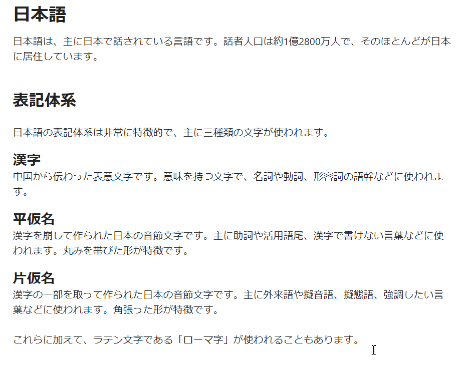
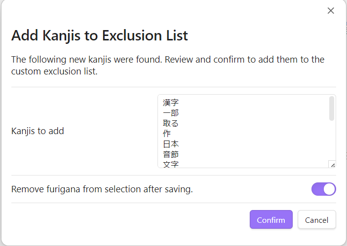

### English • [日本語](./README-ja.md)

# Obsidian Furigana Generator

Obsidian Furigana Generator is a plugin for [Obsidian](https://obsidian.md) that generates furigana for Japanese texts. The plugin includes logic and dictionary files necessary for furigana generation.

## Features

-   **Automatic Furigana Generation**: Add furigana to selected Japanese text or an entire note with a single command.
-   **Filtering**:
    -   **JLPT Levels**: Exclude kanji from specific JLPT levels (N1-N5) that you already know.
    -   **Custom Exclusion List**: Create a personal list of words to be ignored during furigana generation.
-   **Granular Control**: Set the scope to add furigana to every word occurrence, or only the first time a word appears in a sentence, paragraph, or the entire text.
-   **Easy Workflow**: Access commands through the Command Palette or the right-click context menu.
-   **Safe Processing**: Skips headings, links, code blocks, and existing furigana to prevent formatting issues in your notes.

## Installation

1. Download and install **Obsidian** from [obsidian.md](https://obsidian.md/)
2. Enable community plugins by going into Settings → Community plugins → Turn on community plugins
3. Install **Furigana Generator** by clicking "Browse" → Search for "Furigana Generator" → Install → Enable

## Usage

You can add or remove furigana using the Command Palette or the right-click context menu. The behavior of the furigana generation can be customized in the [plugin settings](#settings) (e.g., applying furigana to every instance of a word vs. only the first instance in a paragraph).

### Command Palette

1.  Open the Command Palette (default hotkey is `Ctrl+P` (or `Cmd+P` on macOS)).
2.  Type "Furigana" to see the available commands.

The following commands are available:

-   **Add furigana to selection**: Generates and adds furigana to the Japanese text you have highlighted.
-   **Remove furigana from selection**: Removes all furigana from the highlighted text.
-   **Add furigana to note**: Scans the entire current note and adds furigana to all Japanese text.
-   **Remove furigana from note**: Removes all furigana from the entire current note.
-   **Mark kanjis to exclude...**: Extracts words that include kanji from the selection to be added to the custom exclusion list. Words in this list will be ignored during furigana generation. This is useful for proper nouns or words you already know. You have a chance to review and edit detected kanjis before adding them to the exclusion list.

### Context Menu (Right-Click)

You can also access the commands by right-clicking in the editor. The options that appear depend on whether you have text selected.

-   **If you have text selected**: The menu will show options to add/remove furigana from the selection and add the selection to the exclusion list.
-   **If you do not have text selected**: The menu will show options to add/remove furigana for the entire note.

> **Note**: You can enable or disable the context menu commands in the plugin settings under "Show commands in context menu". This is enabled by default.

## Settings

You can customize the plugin's behavior by navigating to `Settings` → `Community Plugins` → `Furigana Generator`.

### General

-   **Language**: Sets the display language for the plugin's interface and commands. Available languages are English and Japanese.
> [!NOTE]  
> After changing the language, you may need to reload Obsidian for the changes to fully apply in the command palette and context menus.

-   **Furigana generation scope**: Controls how frequently furigana is added for recurring words within a given text.

    -   **Every occurrence**: (Default) Adds furigana to every instance of a word.
    -   **First occurrence in each sentence**: Adds furigana only to the first instance of a word within each sentence.
    -   **First occurrence in each paragraph**: Adds furigana only to the first instance of a word within each paragraph.
    -   **First occurrence in the entire target text**: Adds furigana only the very first time a word appears in the selected text or the entire note.

-   **Exclude headings**: If enabled, furigana will not be generated for any text within a heading (e.g., `# My Heading`). Adding furigana to headings can break your [links to them](https://help.obsidian.md/Links+and+backlinks/Internal+links#Link+to+a+heading+in+a+note) so be careful when generating furigana for headings.

-   **Show commands in context menu**: If enabled, the plugin's commands will appear in the right-click context menu in addition to the command palette.

### Appearance

-   **Hide furigana unless hovered**: If enabled, furigana will be hidden by default and will only appear when you hover your mouse over the word.

    > **Note**: The [Japanese Novel Ruby](https://github.com/k-quels/japanese-novel-ruby) plugin has the same setting which might conflict with this one, please double check before toggling and use only one setting for this.

-   **Furigana font size**: Adjusts the size of the furigana text relative to the main font size. You can use the slider to set a value between 50% (default) and 150%.

-   **Syntax**: Determines the markup used for generating furigana.

    -   **Ruby**: (Default) Uses HTML `<ruby>` tags, which render correctly in Obsidian's reading view out of the box.
    -   **Markdown**: Uses the `{kanji|reading}` syntax.
    -   **Japanese Novel**: Uses the `kanji《reading》` syntax.
> [!WARNING]  
> To properly render the `Markdown` or `Japanese Novel` syntaxes in reading view, you will need to install a corresponding plugin like [Markdown Furigana](https://github.com/steven-kraft/obsidian-markdown-furigana) or [Japanese Novel Ruby](https://github.com/k-quels/japanese-novel-ruby). This setting is here to support users of the mentioned plugins.

### Filtering

-   **JLPT Filtering**: This section allows you to prevent furigana generation for kanji based on their JLPT level. For example, if you are comfortable with N5 kanji, you can uncheck the "Include kanji from JLPT N5" option to stop adding furigana to them.

-   **Custom Exclusion List**: Here you can specify a list of words that should **never** have furigana added.
    -   Add one word per line.
    -   Verbs must be in their basic (dictionary) form (e.g., `食べる` instead of `食べます` or `食べた`).
    -   You can also add words to this list directly from the editor using the `Mark kanjis to exclude...` command.

## Feedback

If you have a suggestion or want to report a bug, please create a GitHub issue.

## Support the Developer

If you find this plugin useful, please consider buying me a coffe.

